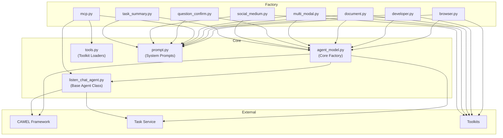

# Agent Module

This module provides the agent infrastructure for eigent, built on top of the CAMEL framework.

## Architecture Overview

## File Descriptions

| File | Purpose |
|------|---------|
| `agent_model.py` | Core factory function for creating agents with event loop management |
| `listen_chat_agent.py` | Base agent class extending CAMEL's ChatAgent with task tracking |
| `tools.py` | Toolkit and MCP tools loader utilities |
| `prompt.py` | System prompts for all 8 agent types |

### Factory Files

| File | Agent Type | Async | Key Toolkits |
|------|------------|-------|--------------|
| `browser.py` | Senior Research Analyst | No | HybridBrowserToolkit, SearchToolkit, TerminalToolkit |
| `developer.py` | Lead Software Engineer | Yes | TerminalToolkit, WebDeployToolkit, ScreenshotToolkit |
| `document.py` | Documentation Specialist | Yes | FileToolkit, PPTXToolkit, ExcelToolkit, GoogleDriveToolkit |
| `multi_modal.py` | Creative Content Specialist | No | VideoDownloadToolkit, ImageAnalysisToolkit, AudioAnalysisToolkit |
| `mcp.py` | MCP Server Agent | Yes | McpSearchToolkit, dynamic MCP tools |
| `question_confirm.py` | Question Confirmation | No | Minimal (wrapper only) |
| `social_medium.py` | Social Media Manager | Yes | WhatsAppToolkit, TwitterToolkit, LinkedInToolkit, etc. |
| `task_summary.py` | Task Summarizer | No | Minimal (wrapper only) |
