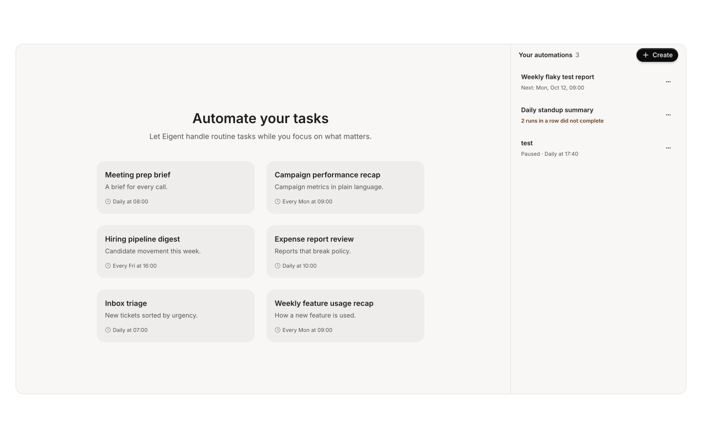
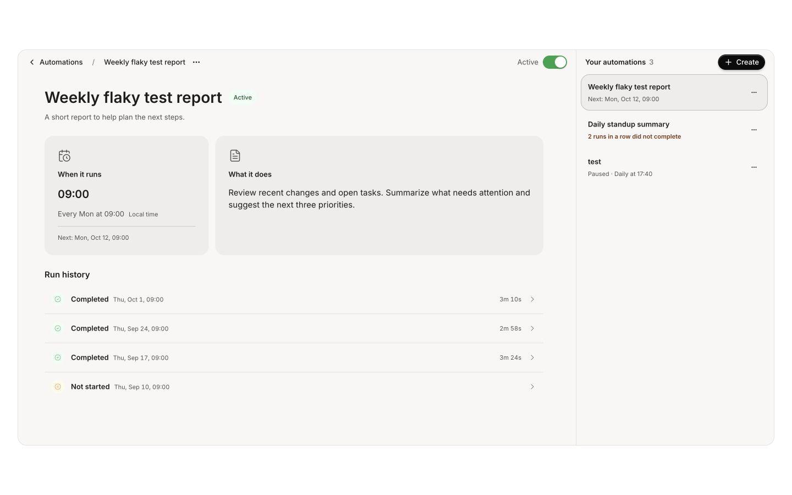
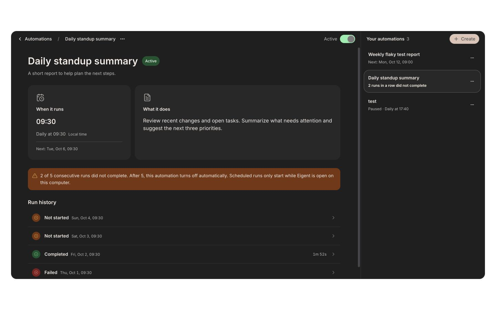
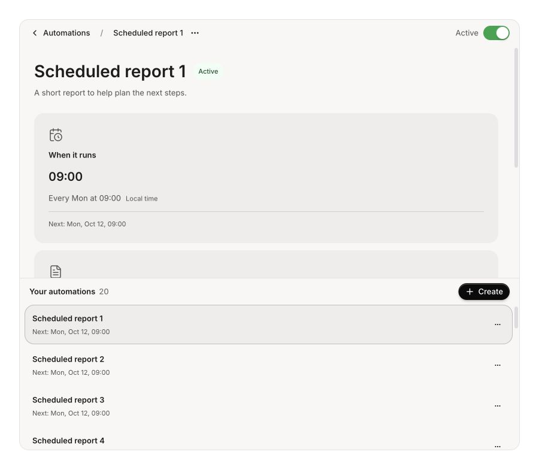

# Automation redesign review evidence

Reviewed on 5 October 2026 against `origin/main` (`5877598509f64e4c2d33771a1c60bf7dd3666977`) for [PR #2016](https://github.com/eigent-ai/eigent/pull/2016).

## Review result

Ready for human review with the runtime limitations below. No remaining actionable findings were identified in the reviewed scope. The review covered the committed PR and subsequent design changes, including manual execution request wiring, scheduling, async history refresh, actions, layout and localized copy.

Fixed during review:

- **Run-history race:** a slow initial request could replace a newer terminal result. History requests now ignore superseded responses and refresh when an existing execution log changes status, including older runs completing after a newer run starts. The regression test resolves responses in reverse order.
- **Schedule initialization:** midnight UTC was interpreted as an unchosen time, including on edits and example drafts. Only a blank create form now uses the next-full-hour default. Component tests cover existing schedules, drafts and blank creation.
- **Narrow-window overflow:** an unbounded stacked queue could consume the main panel's height when many automations exist. The stacked queue is capped at 40% of the available height and scrolls independently; desktop sizing remains the shared Files rail width. Verified with 20 items at 900 × 780.
- **Heading semantics:** removed the redundant hidden page heading now that the examples view owns its visible `h1`.

The midnight initialization behavior existed before this PR; the new draft-prefill flow made preserving its selected time part of this change's contract. The other fixes address the redesigned surface.

## Validation

Passed:

- 89 focused tests across `AutomationDashboard`, `SchedulePicker`, `automationSchedule`, `triggerApi` and automation terminology.
- `npm run type-check`
- `npm run check:i18n`
- `npm run check:design-tokens`
- ESLint on changed TypeScript files with `--max-warnings 0`.
- Prettier on changed source and locale files.
- `git diff --check`

Browser verification used production components in Storybook: shared six examples, selected details, title dropdown, pause toggle, compact list actions, run disclosure, whole-row hover, light/dark themes and a large queue in a narrow window. Loading, fetch error, empty history, stored output and verification-required disabled actions were covered by component tests. Keyboard menu dismissal was exercised in the browser.

Not performed: live Electron/backend manual-run execution, a full keyboard/accessibility audit, 200% zoom, and a dedicated reduced-motion browser run. The Run now request uses the existing owner-checked execution endpoint and subscription flow; service tests verify its manual execution payload. HTTP acceptance is reported as queued, not completed. Screenshots and test results were agent-verified; human acceptance remains pending.

## Design contract

Reused `ContentHeader`, `Button`, `DropdownMenu`, `Switch`, `Tag`, `DsText`, `DsIcon`, `Separator`, shared focus-ring and scrollbar recipes, and the Files right-rail width pattern.

Cards use `neutral.default.default`; the canvas uses `neutral.subtle.default`; hover and selected boundaries use semantic hairline roles. Active status uses the success tone. Controls use supported ghost/primary/outline axes and header size `sm`; both detail-card icons use `detailed`. The product-requested 44px header differs from the canonical 40/48px recipes and is registered as the `automation-panel-headers` exception. Generated token files were not edited.

No other open automation/schedule PR was found in the checked list of 50 open PRs. The current branch already contains the fetched main commit. Scope remains the automation surface and existing execution API integration.

## Screenshots

The screenshots use sample Storybook data.

